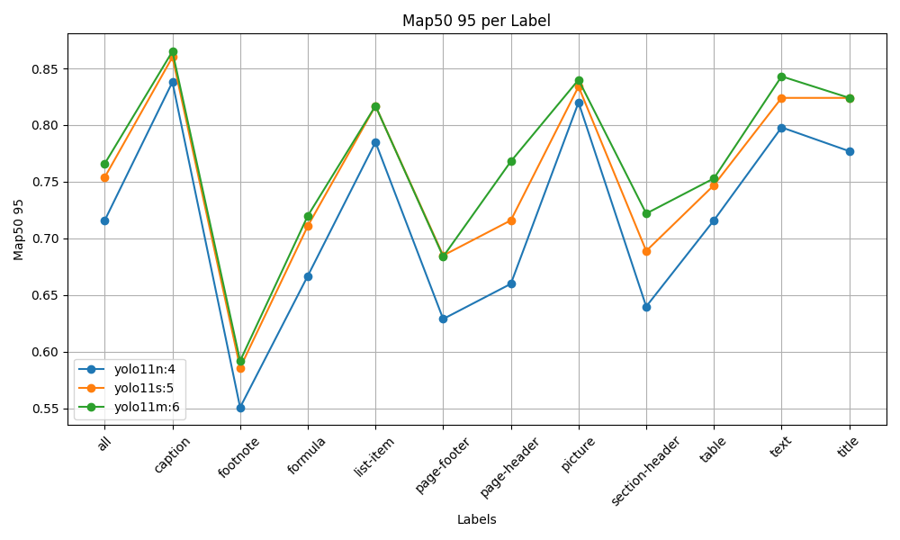
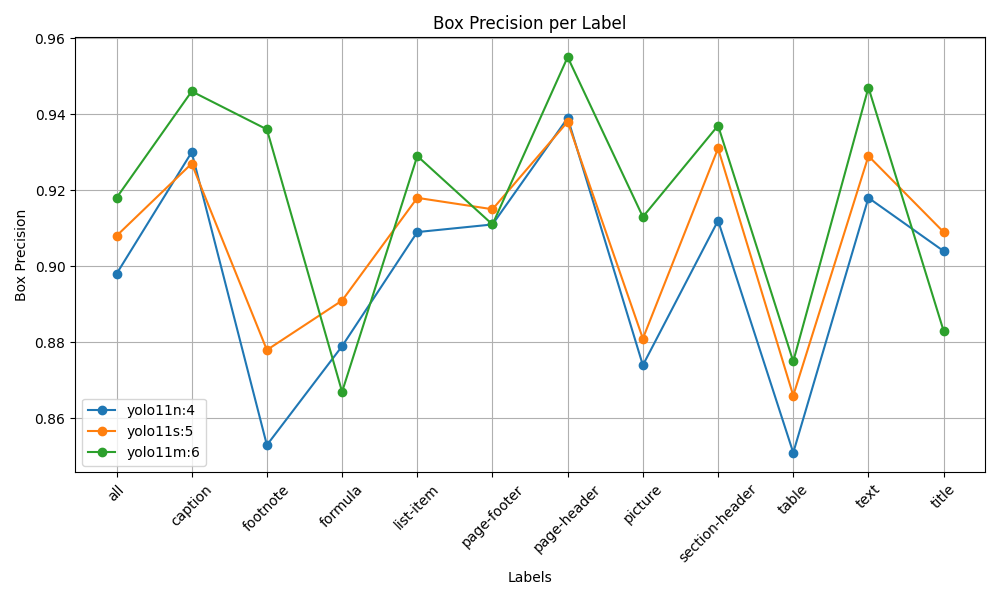

<div id="top"></div>
<br/>
<br/>
<br/>


<p align="center">
  
</p>
<h1 align="center">
    <a href="https://github.com/Armaggheddon/yolo11_doc_layout">Yolo11 Document Layout 🔎📄</a>
</h1>

<div align="center">

<p align="center">
  <a href="https://huggingface.co/Armaggheddon/yolo11-document-layout">
    
  </a>
  <a href="https://huggingface.co/spaces/Armaggheddon/yolo11-document-layout">
    
  </a>
  <a href="https://github.com/Armaggheddon/yolo11_doc_layout/blob/main/LICENSE">
    
  </a>
</p>

</div>


This repository contains **high-performance YOLOv11 models** for Document Layout Analysis, fine-tuned on the [DocLayNet dataset](https://huggingface.co/datasets/ds4sd/DocLayNet). The models are designed to accurately detect 11 common document structures like titles, tables, text, and figures right out of the box.

The primary goal of this repository is to showcase the models' capabilities and provide a simple way to use them. For a deep dive into the training methodology and performance metrics, please see the **[Hugging Face Model Card](https://huggingface.co/Armaggheddon/yolo11-document-layout)**.

## 🚀 Get Started: Inference in Seconds

You can easily use the pre-trained models hosted on the Hugging Face Hub for your own document analysis tasks. Or try out the models directly in your browser using the [Hugging Face Space](https://huggingface.co/spaces/Armaggheddon/yolo11-document-layout).

### 1. Installation

Clone this repository and install the required dependencies.

```bash
git clone https://github.com/Armaggheddon/yolo11_doc_layout.git
cd yolo11_doc_layout
pip install -r requirements.txt
```

### 2. Run Inference
The following script downloads the recommended YOLOv11-Nano model and runs inference on a local image. You can easily switch to the small or medium models by changing the index in the `model_files` array.

```python
from pathlib import Path
from huggingface_hub import hf_hub_download
from ultralytics import YOLO

# Define the local directory to save models
DOWNLOAD_PATH = Path("./models")
DOWNLOAD_PATH.mkdir(exist_ok=True)

# Choose which model to use
# 0: nano, 1: small, 2: medium
model_files = [
    "yolo11n_doc_layout.pt",
    "yolo11s_doc_layout.pt",
    "yolo11m_doc_layout.pt",
]
selected_model_file = model_files[0] # Using the recommended nano model

# Download the model from the Hugging Face Hub
model_path = hf_hub_download(
    repo_id="Armaggheddon/yolo11-document-layout",
    filename=selected_model_file,
    repo_type="model",
    local_dir=DOWNLOAD_PATH,
)

# Initialize the YOLO model
model = YOLO(model_path)

# Run inference on an image
# Replace 'path/to/your/document.jpg' with your file
results = model('path/to/your/document.jpg')

# Save the results
results[0].save(filename="result.jpg")
```

## ✨ The Models: Nano, Small, and Medium
Three model variants are available, allowing you to choose the perfect balance between speed and accuracy for your needs.

| Model Filename | Size |Recommended Use Case |
| :---: | :---: | :--- |
| yolo11n_doc_layout.pt (*train4*)| Nano | **(Recommended)** Best for real-time applications and environments with limited resources. Offers an excellent balance of speed and high-quality detections. |
| yolo11s_doc_layout.pt (*train5*)| Small | A great mid-point, providing a boost in accuracy over the nano model with a moderate increase in computational cost. |
| yolo11m_doc_layout.pt (*train6*)| Medium | The highest accuracy model, suitable for offline processing or when maximum precision is the top priority. |

## 📊 Performance Highlights
As expected, larger models achieve higher raw accuracy, but the nano (`train4`) and small (`train5`) models provide most of the performance at a fraction of the cost. The **nano model stands out for** its exceptional efficiency and high-quality localization.

| mAP@50-95 (Strict IoU) | Precision (Box Quality) |
| :---: | :---: |
|  |  |

> ➡️ For a full analysis and comparison, see the [Hugging Face Model Card](https://huggingface.co/Armaggheddon/yolo11-document-layout).


## 📚 About the Dataset
The models were trained on the [DocLayNet dataset](https://huggingface.co/datasets/ds4sd/DocLayNet), a large and diverse collection of documents annotated with 11 layout categories:
- `Caption`, `Footnote`, `Formula`, `List-item`, `Page-footer`, `Page-header`, `Picture`, `Section-header`, `Table`, `Text`, `Title`

The original dataset is in COCO format and was converted to the required YOLO format using the [`doclaynet2yolo.py`](doclaynet2yolo.py) script included in this repository. All models were trained at a 1280x1280 resolution to ensure high performance on documents with small text elements like `footnotes` and `captions`.


## 📂 Training Runs and Validation

The `runs` directory contains all the artifacts generated during the training of the nano, small, and medium models. This includes training metrics, configuration files, and sample batches, providing full transparency into the training process.

Each sub-directory (e.g., `runs/train4`) corresponds to a specific training run and contains:
- **`args.yaml`**: The complete set of training arguments and hyperparameters used.
- **Plots**: Visualizations of performance metrics like mAP, precision, and recall curves (e.g., `results.png`, `BoxP_curve.png`).
- **Sample Batches**:
    - `train_batch*.jpg`: Images from the training set with ground truth labels.
    - `val_batch*_labels.jpg`: Validation images with ground truth labels.
    - `val_batch*_pred.jpg`: Model predictions on the same validation images, allowing for a direct comparison.


The validation results of each training run are also available in the respective `valX` folder.

## 📄 License
This project is licensed under the MIT License. See the [LICENSE]() file for details.