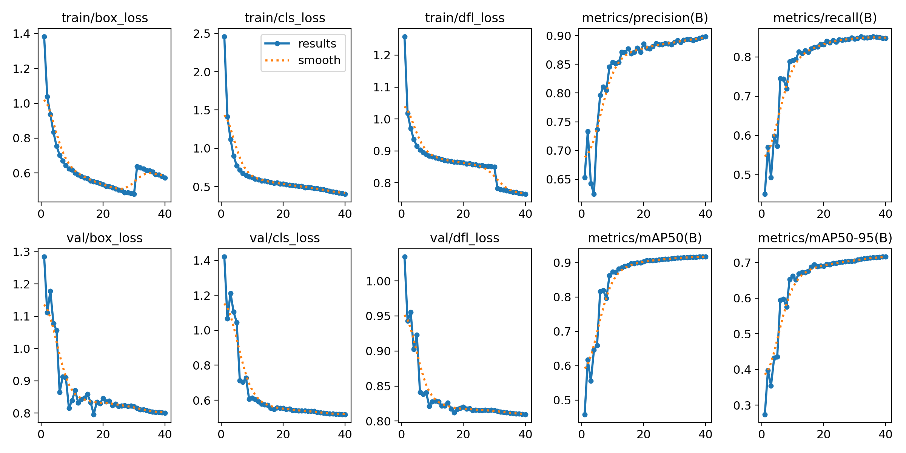
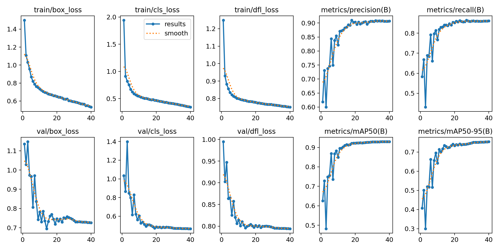
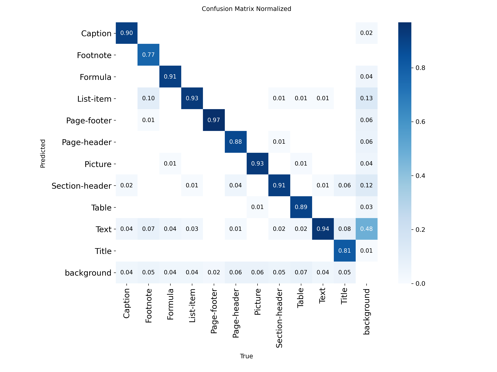
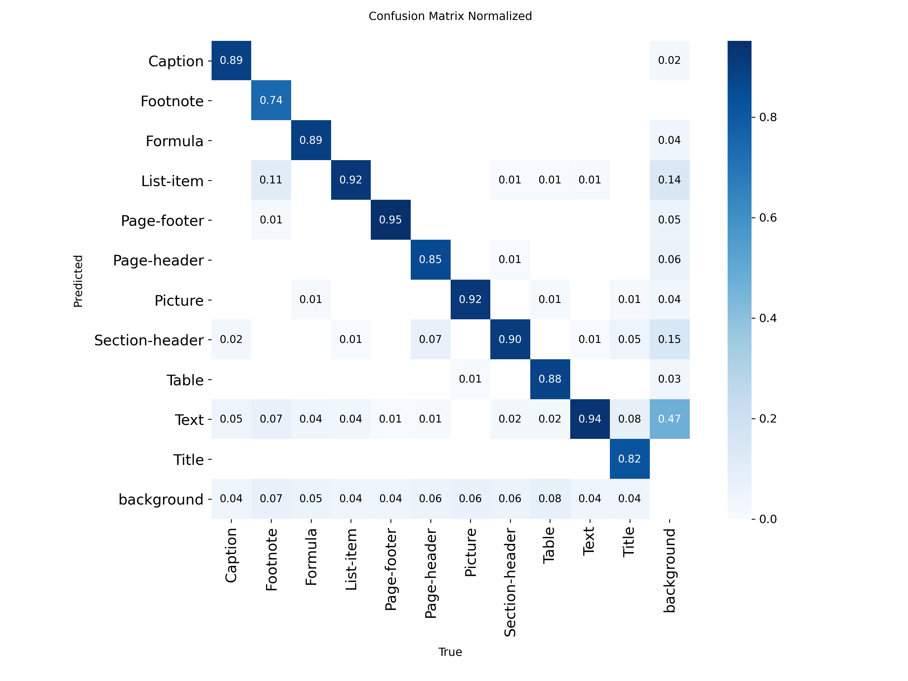
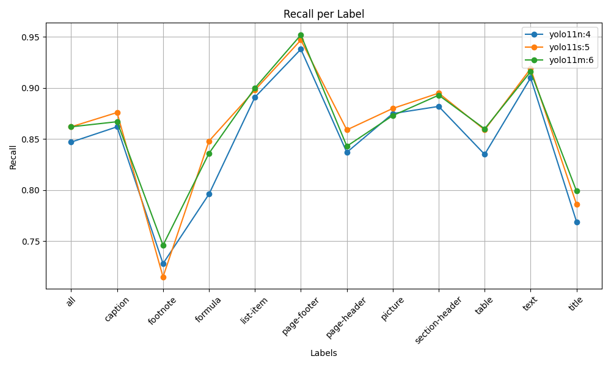

# YoloV11 Document Layout Analysis

Welcome to the YoloV11 Document Layout project! This project delves into the fascinating world of document layout analysis using the power of YOLOv11. The goal is to train and evaluate different YOLO models to accurately detect various elements within a document, such as text blocks, tables, and figures.

In this project, three different models have been trained and fine-tuned, which are named `train4`, `train5`, and `train6`. The performance of these models has been thoroughly analyzed to determine the optimal configuration.

## Models on the Spotlight

The study experimented with three core model configurations from the training runs:

*   **`train4`**: The lightweight champion, the YOLOv11n (nano) model.
*   **`train5`**: A YOLOv11s (small) model, representing a step up in size.
*   **`train6`**: The powerhouse, a YOLOv11m (medium) model.

The document below details how the models stack up against each other.

### Training and Evaluation at a Glance

Before comparing the models directly, it is beneficial to analyze their individual training journeys. The plots below illustrate the core metrics (such as precision, recall, and mAP) as the models learned over time. The confusion matrix for each model provides a visual breakdown of how effectively it learned to distinguish between the different document layout elements. A perfect model would display a bright diagonal line from top-left to bottom-right, indicating minimal confusion between classes.

#### `train4` (YOLOv11n)

| Training Metrics | Normalized Confusion Matrix |
| :--- | :--- |
|  |  |

#### `train5` (YOLOv11s)

| Training Metrics | Normalized Confusion Matrix |
| :--- | :--- |
|  |  |

#### `train6` (YOLOv11m)

| Training Metrics | Normalized Confusion Matrix |
| :---| :--- |
|  |  |

#### `train9` (YOLOv11n)

| Training Metrics | Normalized Confusion Matrix |
| :--- | :--- |
|  |  |

These metrics establish a solid baseline for understanding each model's strengths and weaknesses prior to direct comparisons.

## Results and Showdown

Following training and evaluation, the results have been gathered and visualized using a variety of metrics.

### Nano vs. Small vs. Medium

Here is a quick look at how the three primary models compare in terms of key metrics per document layout label.

| **mAP@50-95** | **mAP@50** |
| :---: | :---: |
|  |  |

| **Precision** | **Recall** |
| :---: | :---: |
|  |  |

As shown, the larger models (`train5` and `train6`) generally exhibit better performance across the board, which is expected given their increased complexity. However, the nano model, `train4`, offers notable efficiency benefits when considering its speed and resource footprint.

### Why `train4` (YOLOv11n) is the Best, All Things Considered

When deploying models in real-world scenarios, performance is not solely defined by accuracy; it must be balanced with speed and resource consumption. This is where the `train4` (YOLOv11n) model truly excels.

While `train5` and `train6` may achieve higher overall scores, `train4` provides an excellent balance of performance and efficiency. The percentage improvement plots illustrate the performance gains realized by moving to larger models.

| **mAP@50-95 % Improv.** | **mAP@50 % Improv. |
|:---: | :---: |
|  |  |

| **Precision % Improv.** | **Recall % Improv. |
| :---: | :---: |
|  |  |

From these plots, the performance gains are noticeable, but the nano model (`train4`) holds its ground remarkably well, especially for certain labels. For applications where speed is critical and computational resources are limited, `train4` offers a lightweight solution with very respectable accuracy.

### The `train4` vs. `train9` Showdown: A Lesson in Quality Over Quantity

While the initial comparison focused on models of different sizes, a deeper analysis was conducted between two nano models: `train4` (Iter 4) and a subsequent iteration, `train9` (Iter 9). Although both models converged to nearly identical overall mAP scores and `train9` displayed a smoother training curve, **`train4` ultimately proved to be the more reliable choice for production due to superior localization accuracy.**

`train9`’s training progression prioritized **detection coverage (Recall)**, resulting in a model that is less reliable in accurately defining object boundaries compared to `train4`. This lack of precision makes `train9` suboptimal for tasks requiring high data integrity.

The justification for selecting `train4` is rooted in its substantial gains in key quality metrics:

*   **Superior Box Precision:** `train4` delivered highly accurate bounding boxes, evidenced by an improvement of over **9.0%** in Box Precision for the `title` category, and similar strong gains in `section-header` and `table`. This indicates that `train9` lagged significantly in object localization.
*   **Maximized mAP Quality:** `train4` achieved a 2.4% improvement in mAP50 and a 2.05% improvement in mAP50_95 for the challenging `footnote` element. This demonstrates `train4`'s superior capability in reaching high Intersection over Union (IOU) quality thresholds, which `train9` missed.

In essence, **`train9` traded bounding box quality for detection quantity.** If the goal is a robust production model that outputs accurately located data, the high localization precision of **`train4`** makes it the more optimal and reliable choice.

Here are some more detailed plots specifically for the best-performing nano model, `train4`.

| **mAP@50-95** | **mAP@50** |
| :---: | :---: |
|  |  |

| **Precision** | **Recall** |
| :---: | :---: |
|  |  |

## Conclusion

This project successfully demonstrates the capabilities of YOLOv11 for document layout analysis. The study has shown that while larger models provide higher raw accuracy, the YOLOv11n model (`train4`) is a strong contender, offering an excellent compromise between performance and efficiency. The analysis of `train4` versus `train9` underscores the importance of prioritizing localization accuracy (precision) over sheer detection coverage (recall) when deploying models for critical data extraction tasks.