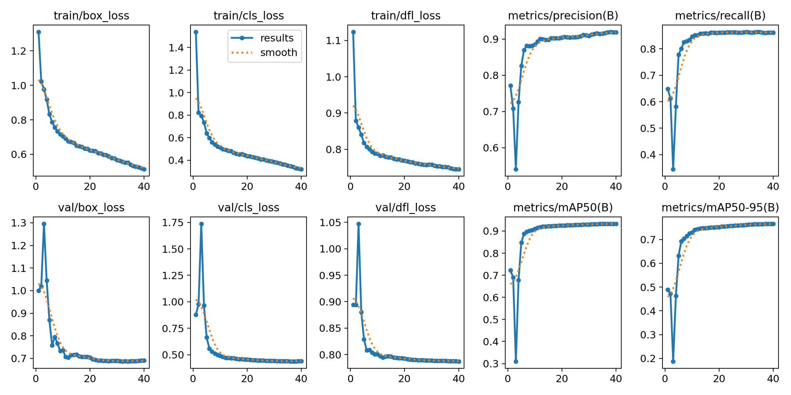
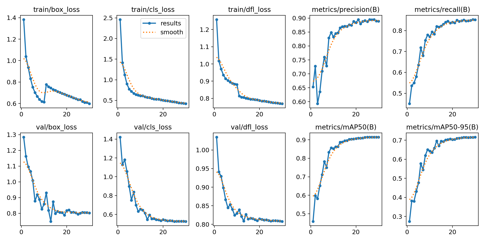

# YOLOv11 Document Layout


This page documents a comprehensive study on Document Layout Analysis using the YOLOv11 model family with the ultralytics library. The primary objective of this project is the training and evaluation of highly optimized YOLO models capable of accurately detecting various elements within documents, such as text blocks, tables, and figures. The models have been finetuned on the DocLayNet dataset that provides a rich variety of annotated document layouts.

The project involved fine-tuning three version of the YOLOv11 family, the `n` (nano), `s` (small), and `m` (medium) models.

The final, recommended model, **yolo11n_doc_layout.pt (train4)**, offers the best balance of speed and localization quality.


## 🚀 How to use 

### Installation

To run the model locally, ensure the necessary libraries are installed:

```bash
pip install -r requirements.txt
```

### Inference Example

This Python snippet demonstrates how to load and run inference on the document layout analysis model:

```python
from pathlib import Path
from huggingface_hub import hf_hub_download
from ultralytics import YOLO

DOWNLOAD_PATH = Path(__file__).parent / "models"

available_models = [
    "yolo11n_doc_layout.pt",
    "yolo11s_doc_layout.pt",
    "yolo11m_doc_layout.pt",
]

model_path = hf_hub_download(
    repo_id="Armaggheddon/yolo11-document-layout",
    filename=available_models[0],  # Change index for different models
    repo_type="model",
    local_dir=DOWNLOAD_PATH,
)

# Initialize the model from the downloaded path
model = YOLO(model_path)

# Load an image (replace 'path/to/your/document.jpg' with your file)
results = model('path/to/your/document.jpg')

# Process and display results
results.print()
results.show()
```


## Dataset Overview: DocLayNet
The models were trained on the [DocLayNet dataset](https://huggingface.co/datasets/ds4sd/DocLayNet), which contains a diverse collection of document images annotated with various layout elements. The dataset includes the following key labels:
- **Text:** Regular paragraphs.
- **Picture:** A graphic or photograph.
- **Caption:** Special text outside a picture or table that introduces this picture or table.
- **Section-header:** Any kind of heading in the text, except overall document title.
- **Footnote:** Typically small text at the bottom of a page, with a number or symbol that is referred to in the text above.
- **Formula:** Mathematical equation on its own line.
- **Table:** Material arranged in a grid alignment with rows and columns, often with separator lines.
- **List-item:** One element of a list, in a hanging shape, i.e., from the second line onwards the paragraph is indented more than the first line.
- **Page-header:** Repeating elements like page number at the top, outside of the normal text flow.
- **Page-footer:** Repeating elements like page number at the bottom, outside of the normal text flow.
* **Title:** Overall title of a document, (almost) exclusively on the first page and typically appearing in large font.

All the images of the dataset are 1250x1250 pixels and therefore the training resolution was set to 1280x1280. This is also driven by initial evaluations showing that using the default 640x640 resolution led to a significant drop in performance, especially for smaller elements like `footnote` and `caption`.

More information about the dataset and how it has been created can be found in the [DocLayNet Labeling Guide](https://raw.githubusercontent.com/DS4SD/DocLayNet/main/assets/DocLayNet_Labeling_Guide_Public.pdf).

The dataset labels were mapped to the YOLO format through `doclaynet_to_yolo.py`, ensuring compatibility with the YOLO training pipeline.
The dataset class distribution is visualized in the image below.


---

## The Contenders: Models on the Spotlight

The study experimented with three core model configurations, varying primarily by size:

- **YOLOv11n (train4)**
- **YOLOv11s (train5)**
- **YOLOv11m (train6)**

In reality, the performance gains stepping up the model sizes are marginal especially when considering the increased resource demands. This is notable evident in the improvements from the `s` to `m` model size increase. With all the results considered, the `n` model family (nano) is the most efficient and effective choice for deployment providing a good balance of speed and accuracy.

### Training and Evaluation at a Glance

The plots below illustrate the core convergence metrics (precision, recall, and mAP) as the models learned over time. The normalized confusion matrices provide a visual breakdown of how accurately the models distinguish between different document layout elements—a strong diagonal line indicates robust classification.

| Model | Training Metrics | Normalized Confusion Matrix |
| :---: | :---: | :---: |
| **`train4`** |  |  |
| **`train5`** |  |  |
| **`train6`** |  |  |
| **`train9`** |  |  |


## Results and Performance Showdown

### Nano vs. Small vs. Medium Size Comparison

The plots below compare the performance of the three main models across key metrics for each document layout label.

| **mAP@50-95** (Strict Accuracy) | **mAP@50** (Standard Accuracy) |
| :---: | :---: |
|  |  |

| **Precision** (Box Quality) | **Recall** (Detection Coverage) |
| :---: | :---: |
|  |  |

As anticipated, the larger models (`train5` and `train6`) generally exhibit superior raw performance due to increased complexity. However, the `train4` nano model provides significant efficiency, making the detailed analysis of the nano family essential.

### 🔬 In-Depth Analysis: The Nano Model Family Performance (`YOLOv11n`)

The nano models (`yolo11n`) are the most suitable candidates for real-world deployment due to their minimal resource consumption. This deeper analysis was conducted to find the optimal balance of speed and accuracy within this efficient family.

| **mAP@50-95** (Strict Accuracy) | **mAP@50** (Standard Accuracy) |
| :---: | :---: |
|  |  |

| **Precision** (Box Quality) | **Recall** (Detection Coverage) |
| :---: | :---: |
|  |  |

#### Justification for `train4` and `train9` Selection

The iterations **`train4` (yolo11n.4)** and **`train9` (yolo11n.9)** were selected for direct comparison because they represent two distinct, near-peak optimization strategies within the nano family:

*   **`train9` (Highest Average Performer):** This iteration consistently exhibits the highest or near-highest scores across general categories, particularly in mAP50 and Recall (pink line). It represents the model that achieved the highest overall score based on simple optimization criteria.
*   **`train4` (Localization Integrity Champion):** This iteration (red line) shows exceptional strength in specific, critical areas relating to bounding box quality. It directly competes with `train9` in Box Precision across several labels (e.g., `section-header`, `table`), suggesting a superior focus on accurate localization.

---

### The `train4` vs. `train9` Showdown: Quality Over Quantity

Although both nano models converged to nearly identical overall mAP scores and `train9` displayed a smoother training curve, **`train4` ultimately proved to be the more optimal choice for production** due to its focus on localization accuracy.

The `train9` model's optimization path prioritized **detection coverage (Recall)**, which often sacrifices high-quality object boundaries, making it less reliable for tasks requiring data integrity.

The justification for selecting `train4` is rooted in its substantial gains in key quality metrics:

1.  **Superior Box Precision:** `train4` delivered highly accurate bounding boxes, evidenced by an improvement of over **9.0%** in Box Precision for the `title` category, and strong gains in `section-header` and `table`.
2.  **Maximized mAP Quality:** `train4` achieved a 2.4% improvement in mAP50 and a 2.05% improvement in mAP50_95 for the challenging `footnote` element. This demonstrates `train4`'s superior capability in reaching high Intersection over Union (IOU) quality thresholds.

| Box Precision Improvement | mAP50 Improvement | mAP50-95 Improvement |
| :---: | :---: | :---: |
|  |  |  |

In essence, **`train9` traded bounding box quality for detection quantity.** For a robust production model that outputs accurately located data, the high localization precision of **`train4`** makes it the unequivocally optimal and reliable choice.

---

## Summary

This project successfully demonstrates the advanced capabilities of YOLOv11 for document layout analysis. While larger models offer higher raw accuracy, the YOLOv11n model (`train4`) stands out, providing an excellent compromise between performance and efficiency. The detailed analysis underscores the critical importance of prioritizing **localization accuracy (precision)** over sheer detection coverage (recall) when deploying models for mission-critical data extraction tasks.

---

## More details, code, and examples
For full training scripts, dataset conversion utilities, and end-to-end examples, see the GitHub repository:

https://github.com/Armaggheddon/yolo11_doc_layout